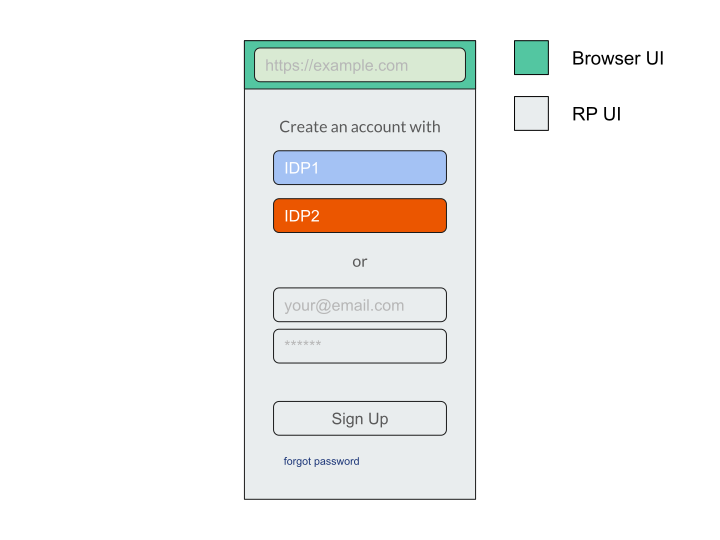

# Topology

Currently, for **consumers**, sign-in flows on websites begin with a login screen that provides the user options to use federated identity, as illustrated in the mock below. Today, clicking the button for an IDP relies on general purpose primitives (typically [redirects or popups](#low-level)) to an IDP sign-in flow.

There is a wide set of privacy and usability goals for identity sharing on the web, but early on we ran into better understanding the structural deployment of federation on the web, specifically the properties that make different activation/adoption strategies more or less plausible.

For example, it is clear that there are relatively few public [IDPs](#idp) in use (say, tens), particularly in comparison to the number of [RPs](#rp) (say, millions) and their users (say, billions). A structural change that only requires adoption by IDPs and no changes or engagement on the part of RPs and users is significantly easier compared to redeploying millions of RPs or retraining billions of users.

Fortunately, in more cases than not (by our estimates, about half of the deployment), RPs implement federated identity importing a script provided by - and under the control of - IDPs, giving us a major deployment vehicle: IDP SDKs loaded into RPs.

Nonetheless, while much of the client-side code is under the (few) IDPs to control (e.g. we can replace redirects by other means), all of the server-side code is under the (many) RPs to control, meaning that that is significantly harder to change (say, years). The cases where RPs implement federated identity without a dynamically loaded SDK will have a longer deployment window and will be discussed separately.

Likewise, changing user behavior and norms is hard because of the number of people involved (say, billions). Unfamiliar login flows could result in users declining to use federated options, and instead opting for username/password credentials during RP account creation. To address that, this proposal aims to provide an experience that minimizes the divergence from existing federated identity user experience as much it possibly can (e.g. introducing new user decisions to be made).

So, with this deployment constraint in mind, let's look at some alternatives under exploration.
